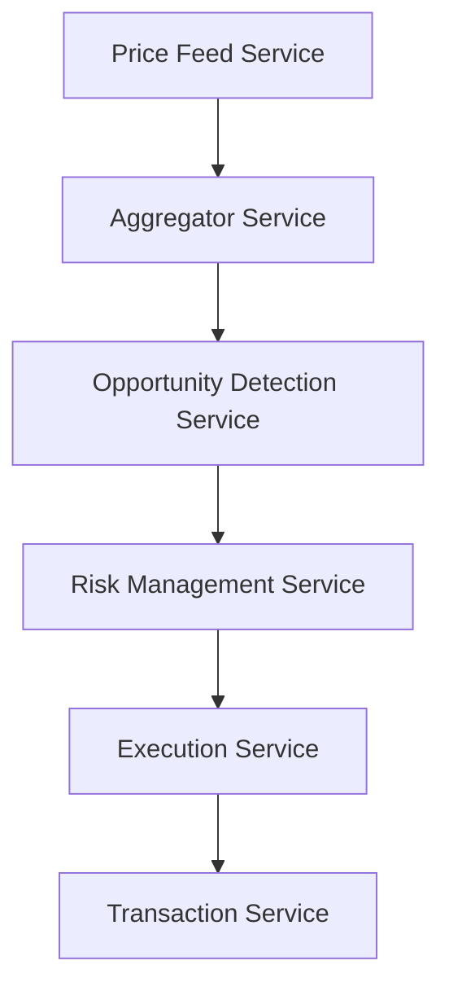

# Technical Specifications and Architectural Decisions

## 1. Data Architecture

### 1.1 Price Feed Aggregation
- **Architecture**: Distributed price feed aggregation
- **Implementation**:
  ```typescript
  interface PriceFeed {
    source: string;
    timestamp: number;
    price: BigNumber;
    confidence: number;
    latency: number;
  }

  class PriceAggregator {
    private feeds: Map<string, PriceFeed[]>;
    private readonly MAX_LATENCY = 500; // ms
    private readonly MIN_CONFIDENCE = 0.95;
    private readonly REQUIRED_SOURCES = 3;
    
    async getAggregatedPrice(token: string): Promise<BigNumber> {
      const validFeeds = this.feeds.get(token)
        .filter(feed => 
          Date.now() - feed.timestamp < this.MAX_LATENCY &&
          feed.confidence >= this.MIN_CONFIDENCE
        );
      
      if (validFeeds.length < this.REQUIRED_SOURCES) {
        throw new InsufficientDataError();
      }
      
      return this.calculateWeightedMedian(validFeeds);
    }
  }
  ```

### 1.2 Data Storage Strategy
- **Primary Database**: TimescaleDB
  - Optimized for time-series data
  - Automatic partitioning by time
  - Efficient aggregation queries
- **Schema**:
  ```sql
  CREATE TABLE price_history (
    time TIMESTAMPTZ NOT NULL,
    token_address TEXT NOT NULL,
    exchange TEXT NOT NULL,
    price NUMERIC NOT NULL,
    volume NUMERIC NOT NULL,
    liquidity NUMERIC NOT NULL,
    CONSTRAINT pk_price_history PRIMARY KEY (time, token_address, exchange)
  );

  SELECT create_hypertable('price_history', 'time');
  ```

### 1.3 Caching Strategy
- **Technology**: Redis
- **Configuration**:
  ```typescript
  interface CacheConfig {
    priceTTL: 30, // seconds
    liquidityTTL: 60, // seconds
    volumeTTL: 300, // seconds
    maxItems: 10000,
    evictionPolicy: 'volatile-lru'
  }
  ```

### 1.4 Data Retention
- Real-time data: 24 hours in Redis
- Historical data: 90 days in TimescaleDB
- Archived data: Compressed and stored in S3
- Archival trigger: Data older than 90 days

## 2. System Architecture

### 2.1 Service Boundaries


### 2.2 Error Handling Protocol
```typescript
interface ErrorResponse {
  code: ErrorCode;
  severity: 'LOW' | 'MEDIUM' | 'HIGH' | 'CRITICAL';
  message: string;
  context: Record<string, any>;
  timestamp: number;
  retryable: boolean;
}

enum ErrorCode {
  PRICE_FEED_TIMEOUT = 'PRICE_FEED_TIMEOUT',
  INSUFFICIENT_LIQUIDITY = 'INSUFFICIENT_LIQUIDITY',
  EXECUTION_FAILED = 'EXECUTION_FAILED',
  NETWORK_CONGESTION = 'NETWORK_CONGESTION'
}

const ERROR_HANDLING_STRATEGY = {
  [ErrorCode.PRICE_FEED_TIMEOUT]: {
    maxRetries: 3,
    backoffMs: 1000,
    escalation: 'MEDIUM'
  },
  [ErrorCode.INSUFFICIENT_LIQUIDITY]: {
    maxRetries: 0,
    backoffMs: 0,
    escalation: 'LOW'
  },
  [ErrorCode.EXECUTION_FAILED]: {
    maxRetries: 2,
    backoffMs: 2000,
    escalation: 'HIGH'
  },
  [ErrorCode.NETWORK_CONGESTION]: {
    maxRetries: 5,
    backoffMs: 5000,
    escalation: 'MEDIUM'
  }
};
```

### 2.3 Monitoring Thresholds
```typescript
const MONITORING_THRESHOLDS = {
  latency: {
    warning: 200, // ms
    critical: 500  // ms
  },
  errorRate: {
    warning: 0.01, // 1%
    critical: 0.05 // 5%
  },
  missedOpportunities: {
    warning: 0.1, // 10%
    critical: 0.25 // 25%
  },
  profitability: {
    minimum: '50 USD',
    target: '200 USD'
  }
};
```

### 2.4 Scaling Strategy
- Horizontal scaling of stateless services
- Vertical scaling of database nodes
- Auto-scaling triggers:
  - CPU utilization > 70%
  - Memory utilization > 80%
  - Request queue length > 1000
  - Response time > 200ms

## 3. Smart Contract Architecture

### 3.1 Gas Optimization
```solidity
contract OptimizedArbitrage {
    // Gas optimization techniques
    uint256 private constant PRECISION = 1e18;
    mapping(address => uint256) private balances;
    
    // Use events instead of storage where possible
    event TradeExecuted(
        address indexed token,
        uint256 amount,
        uint256 profit
    );
    
    // Batch operations to reduce gas
    function batchTransfer(
        address[] calldata tokens,
        uint256[] calldata amounts
    ) external {
        require(
            tokens.length == amounts.length,
            "Length mismatch"
        );
        
        for (uint256 i = 0; i < tokens.length; i++) {
            balances[tokens[i]] += amounts[i];
        }
    }
}
```

### 3.2 Upgradeability Strategy
- Implementation: OpenZeppelin's UUPS proxy pattern
- Timelock: 24 hours for non-emergency upgrades
- Emergency upgrades: Multi-sig with 3/5 signatures

### 3.3 Circuit Breaker Implementation
```solidity
contract CircuitBreaker {
    uint256 public constant MAX_GAS_PRICE = 200 gwei;
    uint256 public constant MIN_PROFIT = 50 ether; // $50 in ETH
    
    modifier checkCircuitBreaker() {
        require(
            tx.gasprice <= MAX_GAS_PRICE,
            "Gas price too high"
        );
        require(
            !emergencyStop,
            "Emergency stop active"
        );
        _;
    }
    
    function executeArbitrage(
        bytes calldata params
    ) external checkCircuitBreaker {
        // Arbitrage logic
    }
}
```

## 4. Integration Architecture

### 4.1 API Versioning
- URL-based versioning: `/api/v1/`
- Supported versions: Latest and Latest-1
- Deprecation notice: 3 months
- Version lifecycle: 12 months

### 4.2 Service Discovery
- Technology: Consul
- Health check interval: 30 seconds
- Deregistration delay: 60 seconds

### 4.3 Load Balancing
- Algorithm: Least connection with health checking
- Session stickiness: None
- Connection draining: 30 seconds
- Retry budget: 10%

### 4.4 Circuit Breaker Configuration
```typescript
interface CircuitBreakerConfig {
  failureThreshold: 0.5, // 50% failure rate
  resetTimeout: 30000, // 30 seconds
  halfOpenState: {
    maxRequests: 10,
    successThreshold: 0.8
  },
  monitoring: {
    windowSize: 60000, // 1 minute
    buckets: 6, // 10-second buckets
    minimumRequests: 20
  }
}
```

## 5. Performance Requirements

### 5.1 Latency Targets
- Price feed updates: < 100ms
- Opportunity detection: < 50ms
- Trade execution: < 200ms
- Total system latency: < 500ms

### 5.2 Throughput Requirements
- Price updates: 1000/second
- Opportunity analysis: 100/second
- Trade execution: 10/second

### 5.3 Resource Utilization
- CPU: < 70% sustained
- Memory: < 80% sustained
- Network: < 60% capacity
- Storage IOPS: < 70% provisioned

## 6. Testing Requirements

### 6.1 Coverage Targets
- Unit tests: 95%
- Integration tests: 85%
- End-to-end tests: 70%

### 6.2 Performance Testing
- Load testing: 2x expected peak load
- Stress testing: 5x expected peak load
- Endurance testing: 72 hours minimum

### 6.3 Security Testing
- Static analysis: SonarQube
- Dynamic analysis: Fuzzing
- Penetration testing: Quarterly
- Smart contract audit: Required for deployment

## 7. Deployment Strategy

### 7.1 Environment Progression
1. Development
2. Integration
3. Staging
4. Production

### 7.2 Deployment Process
```yaml
deployment:
  steps:
    - name: Contract Deployment
      requirements:
        - Security audit passed
        - Gas optimization verified
        - Test coverage met
      
    - name: Service Deployment
      strategy: Blue-Green
      requirements:
        - Integration tests passed
        - Performance benchmarks met
      
    - name: Monitoring Setup
      requirements:
        - Alerting configured
        - Dashboards created
        - Logging verified
```

### 7.3 Rollback Strategy
- Automatic rollback triggers:
  - Error rate > 5%
  - Latency > 1000ms
  - Failed health checks > 3
- Manual rollback process documented
- State recovery procedures defined

## 8. Success Metrics

### 8.1 Technical Metrics
- System uptime: 99.9%
- API availability: 99.95%
- Error rate: < 0.1%
- Average response time: < 200ms

### 8.2 Business Metrics
- Profitable trades: > 95%
- Average profit per trade: > $100
- Missed opportunities: < 5%
- ROI: > 20% monthly

### 8.3 Operational Metrics
- Deployment frequency: Daily
- Lead time for changes: < 24 hours
- Mean time to recovery: < 30 minutes
- Change failure rate: < 5%
## 9. Gas Optimization Plan

This plan outlines the strategies and techniques that will be used to minimize gas consumption in the smart contracts. The goal is to achieve optimal gas efficiency without sacrificing functionality or security.

### 9.1 Gas Optimization Techniques

*   **Data Packing:** Pack multiple variables into a single storage slot to reduce storage costs.
*   **Short Circuiting:** Use short circuiting in conditional statements to avoid unnecessary computations.
*   **Memory vs. Storage:** Use memory instead of storage for temporary variables.
*   **Calldata Optimization:** Use calldata instead of memory for function arguments.
*   **Assembly Optimization:** Use inline assembly for gas-intensive operations.
*   **Minimal Proxy Contract:** Use a minimal proxy contract to reduce deployment costs.
*   **Caching:** Cache frequently accessed data to reduce storage reads.
*   **Efficient Data Structures:** Use efficient data structures such as linked lists and Merkle trees.
*   **Careful Loop Design:** Minimize the number of iterations in loops.
*   **Use of Constants and Immutable Variables:** Use constants and immutable variables to avoid storage reads.

### 9.2 Target Gas Costs

The following table outlines the target gas costs for each function in the smart contracts:

| Function Name        | Target Gas Cost |
| -------------------- | --------------- |
| `executeArbitrage`   | < 300,000       |
| `deposit`            | < 100,000       |
| `withdraw`           | < 100,000       |
| `getPrice`           | < 50,000        |
| `updatePrice`        | < 75,000        |

### 9.3 Gas Monitoring and Analysis

*   **Gas Profiling:** Use gas profiling tools to identify gas-intensive operations.
*   **Gas Limit:** Set a gas limit for each transaction to prevent out-of-gas errors.
*   **Gas Price:** Monitor gas prices and adjust transaction parameters accordingly.
*   **Regular Audits:** Conduct regular gas audits to identify areas for improvement.

### 9.4 Specific Optimizations

*   **Optimize `executeArbitrage` function:**
    *   Reduce the number of external calls.
    *   Use assembly to perform gas-intensive calculations.
    *   Cache frequently accessed data.
*   **Optimize data storage:**
    *   Pack variables into storage slots.
    *   Use memory for temporary variables.
*   **Optimize loop operations:**
    *   Minimize the number of iterations.
    *   Use efficient loop structures.
