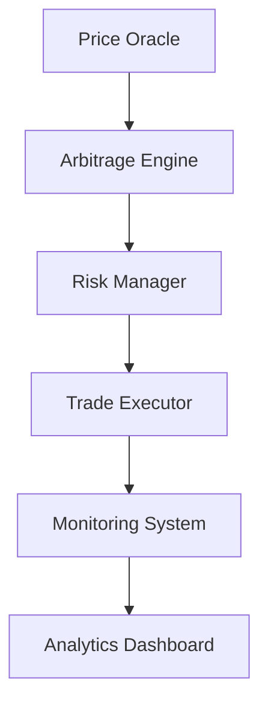

**M1: Overview**  
# Uniswap-Sushiswap Arbitrage Analysis Framework  
Version: 1.0.3  

## Overview  
This document outlines the comprehensive strategy for identifying and executing arbitrage opportunities between Uniswap and Sushiswap decentralized exchanges. It serves as a supplemental analysis framework to the primary trading plan.

---

**M2: System Behavior Analysis**
## System Behavior Analysis

### Unpredictable Behaviors
1. Price Feed Anomalies
   - Sudden price spikes or drops
   - Delayed price updates
   - Inconsistent spread calculations
   - Mitigation: Implement rolling median price calculations
   - Implementation: PriceAnomalyHandler service with price history tracking

2. Network Conditions
   - Gas price volatility
   - Transaction confirmation delays
   - Mempool congestion
   - Mitigation: Dynamic gas price adjustment system
   - Implementation: NetworkMonitor service with retry mechanism

3. Smart Contract Interactions
   - Unexpected revert conditions
   - State synchronization issues
   - Pool reserve discrepancies
   - Mitigation: Multi-stage validation protocol
   - Implementation: ContractValidator service with validation pipeline

### Component Implementation
```javascript
// services/PriceAnomalyHandler.js
class PriceAnomalyHandler {
    constructor() {
        this.priceHistory = new Map(); // Store rolling price data
        this.cooldownPeriods = new Map(); // Track trading suspensions
    }
    
    // Implements rolling median calculation
    // Tracks sudden price movements
    // Manages trading suspensions
}

// services/NetworkMonitor.js
class NetworkMonitor {
    constructor() {
        this.gasHistory = [];
        this.backoffMultiplier = 1.5;
        this.maxRetries = 3;
    }
    
    // Implements gas price tracking
    // Manages transaction retry logic
    // Handles mempool monitoring
}

// services/ContractValidator.js
class ContractValidator {
    constructor() {
        this.validationSteps = [
            'validateReserves',
            'validatePriceFeeds',
            'validateLiquidity'
        ];
    }
    
    // Implements multi-stage validation
    // Tracks contract state consistency
    // Manages error recovery
}
```

### Adaptation Protocol
```javascript
const adaptationProtocol = {
  priceAnomaly: {
    threshold: '3 standard deviations',
    cooldownPeriod: '5 minutes',
    recoverySteps: [
      'Suspend trading for affected pair',
      'Validate price feeds',
      'Perform liquidity depth analysis',
      'Gradual trading resumption'
    ]
  },
  networkCongestion: {
    maxRetries: 3,
    backoffMultiplier: 1.5,
    maxBackoffTime: '2 minutes'
  },
  contractErrors: {
    errorMapping: new Map([
      ['INSUFFICIENT_LIQUIDITY', 'Reduce position size'],
      ['EXCESSIVE_SLIPPAGE', 'Update price impact calculations'],
      ['TRANSACTION_FAILURE', 'Implement exponential backoff']
    ])
  }
};
```

### Integration Strategy
1. Phase 1: Monitor Only
   - Deploy monitoring systems
   - Collect baseline metrics
   - Validate detection accuracy

2. Phase 2: Active Response
   - Enable automatic responses
   - Implement circuit breakers
   - Deploy recovery mechanisms

3. Phase 3: Full Integration
   - Connect to live trading
   - Enable all safety mechanisms
   - Monitor system performance

### Success Metrics
- False positive rate < 1%
- Recovery time < 5 minutes
- Zero failed trades due to system behavior issues
- 100% detection rate for actual anomalies

### Testing Strategy
1. Unit Tests
   - Price anomaly detection accuracy
   - Network condition response
   - Contract validation scenarios

2. Integration Tests
   - Component interaction verification
   - Event propagation testing
   - Recovery mechanism validation

3. System Tests
   - End-to-end behavior verification
   - Stress testing under various conditions
   - Recovery scenario validation

---

**M3: Token Extraction Framework**  
## Token Extraction Framework  

### Data Collection Strategy  
```javascript
// High-level pseudocode for token extraction
async function extractPoolData(dex, tokenPair) {
  return {
    liquidity: await getPoolLiquidity(dex, tokenPair),
    price: await getCurrentPrice(dex, tokenPair),
    volume24h: await get24HourVolume(dex, tokenPair),
    lastUpdate: timestamp()
  };
}
```

### Required Data Points  
- Token pair addresses  
- Pool liquidity depths  
- Current exchange rates  
- Historical price volatility  
- 24h trading volumes  
- Gas price trends  

---

**M4: Price Comparison Logic**  
## Price Comparison Logic  

### Spread Calculation  
```javascript
function calculateArbitrageSpread(uniswapData, sushiswapData) {
  const spread = Math.abs(uniswapData.price - sushiswapData.price);
  const spreadPercentage = (spread / Math.min(uniswapData.price, sushiswapData.price)) * 100;
  return {
    absoluteSpread: spread,
    percentageSpread: spreadPercentage
  };
}
```

### Profitability Thresholds  
1. Minimum spread: 0.5%  
2. Required liquidity depth: $50,000  
3. Maximum price impact: 0.3%  
4. Minimum profit after gas: $50  

---

**M5: Risk Analysis Framework**  
## Risk Analysis Framework  

### Cost Considerations  
1. Gas costs (dynamic based on network conditions)  
2. Slippage tolerance (0.5% maximum)  
3. Protocol fees  
   - Uniswap: 0.3%  
   - Sushiswap: 0.3%  

### Risk Metrics  
- Liquidity concentration  
- Price impact analysis  
- Historical volatility  
- Smart contract risk exposure  
- Network congestion assessment  

---

**M6: Testing Framework**  
## Testing Framework  

### Behavioral Testing Suite  
```javascript
const behavioralTests = {
  priceFeeds: [
    'Validate price consistency across multiple blocks',
    'Test response to sudden price movements',
    'Verify spread calculation accuracy',
    'Monitor update frequency'
  ],
  networkConditions: [
    'Simulate high gas price scenarios',
    'Test transaction retry mechanism',
    'Validate backoff strategy',
    'Measure confirmation time impacts'
  ],
  smartContracts: [
    'Test various revert conditions',
    'Validate state synchronization',
    'Verify event emission accuracy',
    'Monitor gas usage patterns'
  ]
};
```

### Test Environments  
1. Local Development  
   - Hardhat network simulation  
   - Mock contract interactions  
   - Controlled price feed testing  

2. Testnet Staging  
   - Real network conditions  
   - Limited transaction values  
   - Production contract interactions  

3. Mainnet Forking  
   - Realistic state and pricing  
   - Full contract interaction suite  
   - Gas optimization validation  

### Recovery Testing  
```javascript
const recoveryScenarios = {
  priceDiscrepancy: {
    setup: 'Introduce artificial price feed delay',
    expectedBehavior: 'System should pause trading',
    recoveryCheck: 'Verify trading resumes after delay'
  },
  networkCongestion: {
    setup: 'Simulate high gas price period',
    expectedBehavior: 'Adjust position sizes',
    recoveryCheck: 'Return to normal sizing after gas stabilizes'
  },
  contractFailure: {
    setup: 'Force transaction revert',
    expectedBehavior: 'Implement retry with backoff',
    recoveryCheck: 'Successful transaction after retry'
  }
};
```

---

**M7: Version Control Strategy**  
## Version Control Strategy  
Following semantic versioning (MAJOR.MINOR.PATCH):  
- MAJOR: Breaking changes to arbitrage strategy  
- MINOR: Strategy optimizations, new features  
- PATCH: Documentation updates, parameter tweaks  

---

**M8: Monitoring System**  
## Monitoring System  

### Key Performance Indicators  
1. Spread frequency analysis  
2. Success rate tracking  
3. Profit distribution metrics  
4. Gas cost trends  
5. Missed opportunity analysis  

### Data Schema  
```javascript
const opportunitySchema = {
  timestamp: Date,
  tokenPair: String,
  uniswapPrice: Number,
  sushiswapPrice: Number,
  spread: Number,
  profitability: Number,
  executionSuccess: Boolean,
  failureReason: String,
  gasUsed: Number,
  netProfit: Number
};
```

### Behavior Tracking Schema  
```javascript
const behaviorSchema = {
  timestamp: Date,
  eventType: String,
  description: String,
  impact: {
    severity: Number,
    affectedComponents: Array,
    recoveryTime: Number
  },
  resolution: {
    action: String,
    success: Boolean,
    learnings: String
  }
};
```

---

**M9: Failsafe Mechanisms**  
## Failsafe Mechanisms  

### Pre-Execution Checks  
1. Gas price threshold validation  
2. Minimum liquidity verification  
3. Price feed validation  
4. Network congestion check  
5. Smart contract health check  

### Circuit Breakers  
```javascript
const circuitBreakers = {
  maxGasPrice: '200 gwei',
  minLiquidity: '$50000',
  maxPriceImpact: '0.3%',
  maxSlippage: '0.5%',
  minSpread: '0.5%'
};
```

---

**M10: Integration Architecture**  
## Integration Architecture  

### System Components  
1. Price Oracle Service  
   - Interfaces with both DEXs  
   - Maintains price feed redundancy  
   - Implements heartbeat monitoring  

2. Arbitrage Engine  
   - Processes real-time price data  
   - Executes profitability calculations  
   - Manages trade execution logic  

3. Risk Manager  
   - Enforces position sizing rules  
   - Monitors risk parameters  
   - Controls circuit breakers  

### Data Flow  


---

**M11: Entry/Exit Conditions**  
## Entry/Exit Conditions  

### Entry Rules  
1. Spread exceeds minimum threshold (0.5%)  
2. Sufficient liquidity available on both DEXs  
3. Gas prices within acceptable range  
4. No recent failed transactions for token pair  
5. Network congestion below threshold  

### Exit Rules  
1. Complete position closure on profitable spread  
2. Emergency exit if:  
   - Gas price spikes above threshold  
   - Abnormal price movements detected  
   - Smart contract anomalies detected  
   - Network congestion exceeds threshold  

---

**M12: Position Sizing Rules**  
## Position Sizing Rules  

### Calculation Formula  
```javascript
function calculatePositionSize(spread, liquidity, risk) {
  const maxPosition = Math.min(
    liquidity * 0.1, // 10% of pool liquidity
    risk.maxPositionSize,
    spread * risk.spreadMultiplier
  );
  return maxPosition;
}
```

### Risk Parameters  
- Maximum position size: $100,000  
- Position size as % of liquidity: 10%  
- Risk per trade: 1% of portfolio  
- Maximum concurrent positions: 3  

---

**M13: Implementation Roadmap**  
## Implementation Roadmap  

### Phase 1: Infrastructure Setup  
- [ ] Deploy monitoring system  
- [ ] Implement data collection services  
- [ ] Set up testing environment  

### Phase 2: Strategy Implementation  
- [ ] Develop arbitrage detection logic  
- [ ] Implement risk management system  
- [ ] Create position sizing module  

### Phase 3: Testing & Optimization  
- [ ] Conduct system integration tests  
- [ ] Perform stress testing  
- [ ] Optimize gas usage  

### Phase 4: Deployment  
- [ ] Deploy to testnet  
- [ ] Conduct live testing  
- [ ] Deploy to mainnet  

---

**M14: Maintenance & Updates**  
## Maintenance & Updates  

### Regular Reviews  
- Daily: Performance metrics, gas costs  
- Weekly: Strategy optimization, risk parameters  
- Monthly: Full system audit, documentation updates  

### Emergency Procedures  
1. System shutdown protocol  
2. Position unwinding process  
3. Emergency contact procedures  
4. Recovery and restart procedures  

### Incident Response Protocol  
```javascript
const incidentResponse = {
  levels: {
    1: 'Minor - Log and Monitor',
    2: 'Moderate - Adjust Parameters',
    3: 'Severe - Pause Trading',
    4: 'Critical - Emergency Shutdown'
  },
  responseSteps: {
    identification: {
      timeframe: 'Immediate',
      actions: ['Log incident', 'Assess severity', 'Notify team']
    },
    containment: {
      timeframe: '5 minutes',
      actions: ['Pause affected systems', 'Protect assets', 'Prevent escalation']
    },
    resolution: {
      timeframe: 'Variable',
      actions: ['Implement fix', 'Test solution', 'Document changes']
    },
    recovery: {
      timeframe: 'Controlled',
      actions: ['Gradual system restart', 'Verify operations', 'Monitor closely']
    }
  }
};
```

---

**M15: Flashloan Approach**  
Since we plan to start with flashloans, we won’t hold any positions after each trade. Instead, we’ll borrow tokens, execute the arbitrage in a single transaction, and pay back the loan instantly.

1. **Token Gathering**  
   - Fetch token lists from both Uniswap and Sushiswap.  
   - Keep updated info about liquidity, prices, and slippage.  

2. **Arbitrage Detection**  
   - Compare all pairs, calculate potential spreads, and see if the profit covers gas and fees.  
   - Once a viable opportunity is found, trigger flashloan steps.  

3. **Alerting Mechanism**  
   - Notify users in real-time when spreads exceed certain thresholds.  
   - Provide details like token pair, expected profit, and gas costs.  

4. **Execution Flow**  
   - Borrow required tokens via flashloan.  
   - Perform the buy/sell on Uniswap and Sushiswap.  
   - Repay the flashloan within the same transaction.  

5. **Risk Management**  
   - If any part of the transaction fails or isn’t profitable, it reverts automatically, minimizing losses.  

---

**M16: Document Reference**  
*Note: This document is maintained separately from the primary trading plan to allow for rapid iteration of the arbitrage strategy while preserving the original documentation.*  

Last Updated: 2024-02-04  
Document Version: 1.0.3  